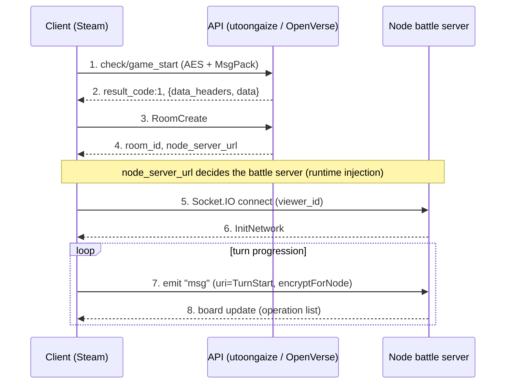

# OpenVerse protocol

## Client

- Shadowverse, Steam (App ID 453480)
- Unity 2020.3.18 LTS, Mono build (Assembly-CSharp.dll decompiles directly)
- Root namespace: `Wizard`
- API framework namespace: `Cute` (Cygames in-house)
- Networking: BestHTTP (Socket.IO client bundled), MessagePack (neuecc), LitJson / MiniJSON, Sqlite3
- Memory tamper protection via CodeStage AntiCheat (ObscuredTypes)

## Servers (production domains)

Values hardcoded in `Cute.CustomPreference.InitFrameWorkSettings`.

| Use | URL | Scheme |
| --- | --- | --- |
| API (PHP) | `utoongaize.shadowverse.jp/shadowverse/` | https |
| Resource CDN | `shadowverse.akamaized.net/` | https |
| Node (battle) | starts empty, set at runtime from the match response `node_server_url` | ws:// (wss:// optional) |
| DeckBuilder | `shadowverse-portal.com/api/v1/game_api/` | https |

- API and CDN are forced to HTTPS by `SetScemeMode(Https)`
- The Node URL starts empty. A match response `data.node_server_url` is passed to `SetNodeServerURL`
- If OpenVerse returns its own Node address in the match response, the client connects there on its own (no binary patch needed)

## Crypto (`CryptAES`)

A random key is generated per message and shipped with the ciphertext. The IV comes from the device UDID.

### API `encrypt` / `EncryptRJ256Api`
- AES-256-CBC, block 128
- key = `Cryptographer.generateKeyString()` (random 32 bytes)
- IV = first 16 bytes of `Certification.Udid` with dashes stripped
- Layout: `[ciphertext][key(32 bytes plaintext)]` (key appended)
- Decryption takes the last 32 bytes as the key

### Node `encryptForNode` / `DecryptRJ256ForNode`
- AES-256-CBC / PKCS7, block 128
- key = random 32 bytes, IV = first 16 bytes of the key
- Layout: `[key(32 bytes plaintext)][base64(ciphertext)]` (key prepended)

## Payload

### API (HTTP)
- Body is built by `_createBodyMsgpack` (default) or `_createBodyJson`
- With `encrypt=true` the body goes through `CryptAES.encrypt` (= EncryptRJ256Api)
- Request: `PostParams` -> JSON -> MessagePack -> AES, sent as raw bytes
- Response: `{ data_headers: { result_code, servertime }, data: {...} }`
- The client reads a response with `CryptAES.decrypt` then `MessagePackSerializer.ToJson`. The body is base64 text
- Success is `result_code == 1`

### Node (Socket.IO)
- Event names `msg` (normal) / `hand` (hand data)
- Send: `JSON -> encryptForNode -> MessagePackSerializer.Serialize(string)`
- Receive: `Deserialize<string> -> decryptForNode -> MiniJSON`
- Each message carries a `uri` field for the command type (InitNetwork / TurnStart / Resume / Watch / Maintenance ...)
- A heartbeat called `Gungnir` keeps the connection alive
- Non-standard mix: the URL reports `EIO=4`, but payload framing is Engine.IO v3 (`[type][ascii length][0xFF]`) and binary attachments are Socket.IO v2 (`{_placeholder,num}` plus a separate chunk with a leading `0x04`). Default transport is polling, upgrading to websocket. PingInterval/PingTimeout are fixed client-side at 2000/5000ms

## Auth

- `PostParams`: `viewer_id`, `steam_id`, `steam_session_ticket`
- Steam session ticket auth
- A private server can stub this by skipping validation and just issuing a `viewer_id`

## Request headers (`NetworkTask.PrepareHeaders`)

Udid, ShortUdid, SessionId, Param, Device, AppVersion, ResVersion, DeviceId, DeviceName, GraphicsDeviceName, IpAddress, PlatformOsVersion, KeyChain, IDFA, Locale, Language, CountryCode, Platform, IsWSS, IsIpv6, DevAccessSecretKey, CardMasterHash

## Startup flow

1. `SetUp.InitFrameWorkSettings`: sets URLs and schemes, calls `NetworkManager.Certification()`
2. `CheckSpecialTitleTask`: first request (encrypt=true, useJson=false). A `Wizard.BaseTask`. Only `data_headers.result_code` and `servertime` are needed
3. `GameStartCheckTask` (`check/game_start`): startup check. A `Cute.NetworkTask`. Needs `data.tos_state`, `policy_state`, `kor_authority_state`, `tos_id`, `policy_id`, `kor_authority_id`
4. On to home

## API endpoints (`CuteNetworkDefine.ApiUrlList`, partial)

`tool/signup`, `check/special_title`, `check/game_start`, `account/get_by_social_account`, `account/chain_by_transition_code`, `payment/*`, `payment_pc/*` (Steam payments)

Main game APIs are `Wizard.BaseTask` derivatives. The path comes from a type (needs more digging).

## Result codes (partial)

- `1` = success
- `204` = version error, `308` = payment validation error
- `2000-2999` = maintenance
- Node side: `30001/30213` = return to title, `30002` = no contest

## Communication sequence (example)

Hosting a room and battling. Diagram: [diagrams/battle-sequence.svg](diagrams/battle-sequence.svg)

Payload wrapping:

- API: `object -> JSON -> AES (key appended) -> HTTP body`
- Node: `object -> JSON -> AES (key prepended) -> MsgPack(string) -> socket.emit`

## Open questions

- Path naming for the main game API (`Wizard.BaseTask` type to path)
- How `DevAccessSecretKey` and `CardMasterHash` are generated and whether the server checks them
- Room match sequence (`Wizard.RoomMatch`: RoomOwner / RoomVisitor / RoomConnectController)
- Battle operation protocol (server-authoritative or not, where card effect logic lives)
