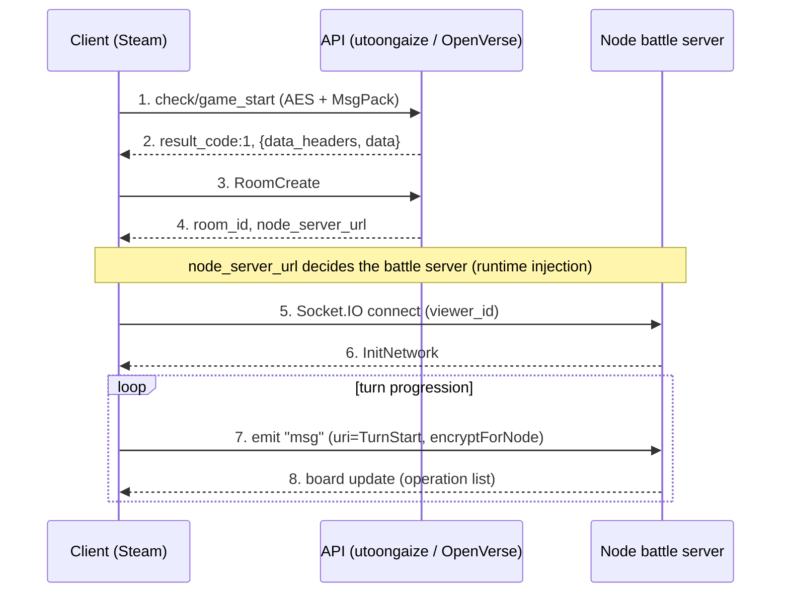

### [日本語版](../protocol.md)

# OpenVerse protocol

## Client

- Shadowverse, Steam (App ID 453480)
- Unity 2020.3.18 LTS, Mono build (Assembly-CSharp.dll decompiles directly)
- Root namespace: `Wizard`
- API framework namespace: `Cute` (Cygames in-house)
- Networking: BestHTTP (Socket.IO client bundled), MessagePack (neuecc), LitJson / MiniJSON, Sqlite3
- Memory tamper protection via CodeStage AntiCheat (ObscuredTypes)

## Servers (production domains)

Values from `Cute.CustomPreference.InitFrameWorkSettings`.

| Use | URL | Scheme |
| --- | --- | --- |
| API (PHP) | `utoongaize.shadowverse.jp/shadowverse/` | https |
| Resource CDN | `shadowverse.akamaized.net/` | https |
| Node (battle) | starts empty, set at runtime from the match response `node_server_url` | ws:// (wss:// optional) |
| DeckBuilder | `shadowverse-portal.com/api/v1/game_api/` | https |

- API and CDN are forced to HTTPS by `SetScemeMode(Https)`
- The Node URL starts empty. A match response `data.node_server_url` is passed to `SetNodeServerURL`
- If OpenVerse returns its own Node address in the match response, the client connects there (no binary patch needed)

## Crypto (`CryptAES`)

### API `encrypt` / `EncryptRJ256Api`
- AES-256-CBC, block 128
- key = `Cryptographer.generateKeyString()` (random 32 bytes)
- IV = first 16 bytes of `Certification.Udid` with dashes stripped
- Layout: `[ciphertext][key(32 bytes plaintext)]` (key appended)
- Decryption takes the last 32 bytes as the key

### Node `encryptForNode` / `DecryptRJ256ForNode`
- AES-256-CBC / PKCS7, block 128
- key = random 32 bytes, IV = first 16 bytes of the key
- Layout: `[key(32 bytes plaintext)][base64(ciphertext)]` (key prepended)

## Payload

### API (HTTP)
- Body is `_createBodyMsgpack` (default) or `_createBodyJson`
- With `encrypt=true` it goes through `CryptAES.encrypt` (= EncryptRJ256Api)
- Request: `PostParams` -> JSON -> MessagePack -> AES, sent as raw bytes
- Response: `{ data_headers: { result_code, servertime }, data: {...} }`
- Read a response with `CryptAES.decrypt` then `MessagePackSerializer.ToJson`. The body is base64 text
- Success is `result_code == 1`

### Node (Socket.IO)
- Event names `msg` (normal) / `hand` (hand data)
- Send: `JSON -> encryptForNode -> MessagePackSerializer.Serialize(string)`
- Receive: `Deserialize<string> -> decryptForNode -> MiniJSON`
- Each message carries a `uri` field for the command type (InitNetwork / TurnStart / Resume / Watch / Maintenance ...)
- A heartbeat called `Gungnir` exists
- Non-standard mix: the URL reports `EIO=4`, but payload framing is Engine.IO v3 (`[type][ascii length][0xFF]`) and binary attachments are Socket.IO v2 (`{_placeholder,num}` plus a separate chunk with a leading `0x04`). Default transport is polling, upgrading to websocket. PingInterval/PingTimeout are fixed client-side at 2000/5000ms

## Auth

- `PostParams`: `viewer_id`, `steam_id`, `steam_session_ticket`
- Steam session ticket auth
- A private server can stub this by skipping validation and just issuing a `viewer_id`

## Request headers (`NetworkTask.PrepareHeaders`)

Udid, ShortUdid, SessionId, Param, Device, AppVersion, ResVersion, DeviceId, DeviceName, GraphicsDeviceName, IpAddress, PlatformOsVersion, KeyChain, IDFA, Locale, Language, CountryCode, Platform, IsWSS, IsIpv6, DevAccessSecretKey, CardMasterHash

## Startup flow

1. `SetUp.InitFrameWorkSettings`: sets URLs and schemes, calls `NetworkManager.Certification()`
2. `CheckSpecialTitleTask`: first request (encrypt=true, useJson=false). A `Wizard.BaseTask`, only needs `data_headers.result_code` and `servertime`
3. `GameStartCheckTask` (`check/game_start`): startup check. A `Cute.NetworkTask`, needs `data.tos_state`, `policy_state`, `kor_authority_state`, `tos_id`, `policy_id`, `kor_authority_id`
4. On to home

## API endpoints (`CuteNetworkDefine.ApiUrlList`, partial)

Startup / auth / payment: `tool/signup`, `check/special_title`, `check/game_start`, `account/get_by_social_account`, `account/chain_by_transition_code`, `payment/*`, `payment_pc/*`

Main game APIs are `Wizard.BaseTask` derivatives, split by type below.

## Deck API

Format wire code (`deck_format` below) is `1=Rotation, 2=Unlimited, 3=PreRotation, 4=Crossover, 5=MyRotation, 10=TwoPick, 20=Sealed, 31=Hof, 33=Windfall, 39=Avatar, 0=All`, a separate system from the internal enum (converted by `FormatConvertApi`).

| Path | Request | Response main fields |
| --- | --- | --- |
| `deck/info` | `deck_format` | Format.All: `data.user_deck_rotation` / `_unlimited` / `_pre_rotation` / `_crossover` / `_my_rotation` / `_avatar` (all guarded). Single format: `data.user_deck_list`, and `data.maintenance_card_list` is always required unguarded |
| `deck/update` | `deck_no, class_id, leader_skin_id, is_random_leader_skin, leader_skin_id_list, sleeve_id, deck_name, is_delete(0/1), card_id_array, deck_format, rotation_id` (Crossover adds `sub_class_id`) | updated user_deck_* group + `data.achieved_info:{}` + `data.reward_list:[]` (both unguarded) |
| `deck/get_empty_deck_number` | `deck_format` | `data.empty_deck_num:int` (0 or less = no slot) |
| `deck/update_name` | `deck_no, deck_name, deck_format` | `data.user_deck` (one) |
| `deck/update_sleeve` | `deck_no, sleeve_id, deck_format` | `data.user_deck` |
| `deck/update_leader_skin` | `deck_no, leader_skin_id, deck_format` | `data.user_deck` |
| `deck/update_order` | `deck_order:int[], deck_format` | updated group |
| `deck/delete_deck_list` | `deck_no_list:int[], deck_format` | updated group |
| `auto_deck/create` | `deck_format, class_id, chosen_card_ids, tournament_id, rotation_id` | `data:[int...]` (flat card id array) |

Required unguarded keys are `deck_name` (string), `class_id` (int 1-8), and `card_id_array` (int[]). The rest are guarded.
Deck-building rules are handled client-side. The server only returns `restricted_card_exists` and `maintenance_card_list`, and since OpenVerse unlocks every card, no ownership check is used.
Deck sharing (portal's `deck_code` / `deck`) is a separate host, self-hosted in OpenVerse.

## Solitaire content API

CP battle (practice) and deck introduction. The battle and AI are client-side, so the server only handles setup and result recording.

| Path | Request | Response main fields |
| --- | --- | --- |
| `practice/info` | (none) | `data:[{practice_id, text_id, class_id, chara_id, degree_id, ai_deck_level, ai_logic_level, ai_max_life, is_campaign_practice, battle3dfield_id, is_maintenance}...]` (plain array, PracticeDataMgr iterates) |
| `practice/deck_list` | `deck_format` (Format.All) | same shape as deck/info (parsed by ParseDeckInfoResponceData) |
| `practice/start` | `practice_id` etc. | `data:{}` (reads mission_parameter if present) |
| `practice/finish` | `deck_no, is_win, evolve_count, total_turn, enemy_class_id, difficulty, deck_format, class_id, mission, recovery_data` | `data:{get_class_experience, class_experience, class_level, achieved_info, reward_list}` (achieved_info may be empty `{}`) |
| `introduce_deck/info` | `series_id` (-1 = latest) | `data:{series_id, display_format, display_deck_list:[deck+player_name+introduction+thumbnail_card_id], series_list:[{series_id, series_name, is_ts_rotation}]}` |
| `introduce_deck/series_list` | (none) | `data:{series_list:[...]}` |

- AI decks and logic load client-side from the `master_practice_ai_setting` bundle by `ai_deck_level`/`ai_logic_level`, so the official ones are used
- Starting a battle needs `open_battle_field_id_list` (an array of unlocked background ids) in load/index, or `BattleManagerBase.CalculationRandomStage` NREs

## Room match API (HTTP side)

| Path | Use | Main response |
| --- | --- | --- |
| `open_room/create_room` | owner creates | `data.room_id` (5-digit numeric string), `data.node_server_url` (scheme stripped), `data.battle_id`, `data.is_invitation_user:bool` (all unguarded) |
| `open_room/enter_room` | visitor enters | `data.result_reason:int` (0=success), `data.oppo_info.{oppoId,battlePoint,degreeId,emblemId,country_code,rank,max_rank,userName,isOfficial}`, `data.node_server_url`, `data.is_friend:int`, `data.guild_id/oppo_guild_id` (all unguarded) |
| `open_room/leave_room` | visitor leaves | `data.result_reason`, `data.room_result:int(1=OK)` |
| `open_room/close_room` | owner closes | `base.Parse` only (result_code=1 is enough) |
| `open_room/force_release_room` | owner force-closes | `data.room_result:int(1=OK)`, client retries with 10s backoff |
| `open_room/initialize_room_battle` | bookkeeping after socket connect, before the battle | `data.battle_id`, `data.my_battle_result:{}`, `data.opponent_battle_result:{}`, `data.used_deck:int`, `data.is_settled:int` |
| `open_room_battle/set_deck` | in-room deck select | not parsed (result_code=1 is enough), variants like `gathering_room_battle/set_deck` |
| `deck/deck_entry` | multi-deck select (Bo3 etc.) | not parsed |
| `open_room/ban_deck` | deck ban phase | not parsed |

Notes:
- `room_id` is a server-assigned 5-digit numeric string
- `node_server_url` is a scheme-less host:port (`127.0.0.1:3001` etc.), the client prepends `ws://`
- The entry notification arrives as a Socket `RoomEntry` push, not HTTP polling
- Socket ACK wait timeout is 10s

## do_matching (waiting for an opponent)

| Path | Use |
| --- | --- |
| `battle/do_matching` | ranked match |
| `open_room_battle/do_matching` | room match |

Response is `data.matching_state:int` (3004=SUCCEEDED, 3007=SUCCEEDED_OWNER, 3011=SUCCEEDED_AI), `data.timeout_period:int`, `data.retry_period:int`, `data.battle_id:string`, `data.node_server_url:string`, `data.card_master_id:int` (on success), and the client polls until it connects.

## Battle (Socket.IO)

Connect to: `ws://<node_server_url>/?EIO=4&transport=websocket`

### WS upgrade headers

On HTTP headers, not the URL query.

- `BattleId`: raw string
- `viewerId`: `CryptAES.encryptForNode(viewerId.ToString())`, first 32 chars are the key, the rest base64 ciphertext
- `User-Agent`: `SystemInfo.operatingSystem`

### Event names

- `msg`: normal event, payload = `MessagePack(CryptAES.encryptForNode(JSON(...)))`, server must ACK with an int `pubSeq`
- `hand`: hand actions (touch / slide / select_skill). payload = `MessagePack(JSON(...))` (no AES)
- `synchronize`: server push only, all uris ride here, so do not name the `event` after the `uri`
- `alive`: heartbeat (Gungnir), starts after InitNetwork succeeds

### payload common fields

- `uri`: command type
- `viewerId:int`
- `uuid:string` (`Certification.Udid`)
- `bid:string` (battle_id assigned after matching)
- `pubSeq:int` (client->server counter, monotonic from 1)
- `playSeq:int` (server->client counter, server-assigned)
- `cat:int` (EmitCategory: `1=battle, 2=matching, 3=room, 11=watch, 99=general`)

### Sequence after connect

1. Client->`InitNetwork` (cat:99) -> Server->`InitNetwork` echo (payload optional, passes once `_initNetworkSuccess` is set)
2. Client->`RoomCreate` (owner) or `RoomEntry` (visitor) (cat:3) -> Server ACK with `resultCode:0`
3. Server->`Matched`: `{uri, bid, turnState:0|1, selfInfo, oppoInfo, selfDeck:[{idx,cardId}...], playSeq:1}`
4. Both->`Loaded` (cat:1, pubSeq:2) -> Server->`BattleStart` (playSeq:2): `{uri, battleStartDate:<unix-microseconds>, selfInfo, oppoInfo}`
5. Server->`Deal` (playSeq:3): `{uri, cards:[{idx,cardId,isSelf,RedrawCardPosition}...]}` -> Client->`Swap` -> Server->`Ready`

### Matched required subkeys

Missing any of these crashes the client.

- `selfInfo`: `rank, classId, charaId, viewerId, userName, fieldId, seed, deckCount`
- `oppoInfo`: same as selfInfo + optional `isOfficial`
- `selfDeck`: `idx, cardId`

### Player identification

The `BattleId` and `viewerId` (needs decrypt) headers on WS upgrade, plus each msg payload's `viewerId` and `uuid`, are cross-checked. The server pairs the opponent's viewerId and puts it in `Matched.oppoInfo.viewerId`.

### ROOM_URI

The `Wizard.RoomMatch.RoomUri` enum value rides as-is. For now only `RoomCreate / RoomEntry / GatheringEntry / Leave / Release / ForceRelease / DeckSelect / DeckConfirm / TurnSelect / RoomReady / Rematch` are used.

## Result codes (partial)

- `1` = success
- `204` = version error, `308` = payment validation error
- `2000-2999` = maintenance
- Node side: `30001/30213` = return to title, `30002` = no contest

## Communication sequence (example)

Room match flow (diagram: [diagrams/battle-sequence.svg](diagrams/battle-sequence.svg)).

Payload wrapping:

- API: `object -> JSON -> AES (key appended) -> HTTP body`
- Node: `object -> JSON -> AES (key prepended) -> MsgPack(string) -> socket.emit`

## Open questions

- How `DevAccessSecretKey` / `CardMasterHash` are generated and whether the server validates them
- Details of all battle URIs after BattleStart (TurnStart / PlayActions / TurnEndActions / TurnEnd / Judge / BattleFinish etc.) and the operation list breakdown
- Where card effects resolve (server side or client side)
- Spec of the recovery endpoints (`open_room/get_recovery_params`, `battle/get_recovery_params`)
