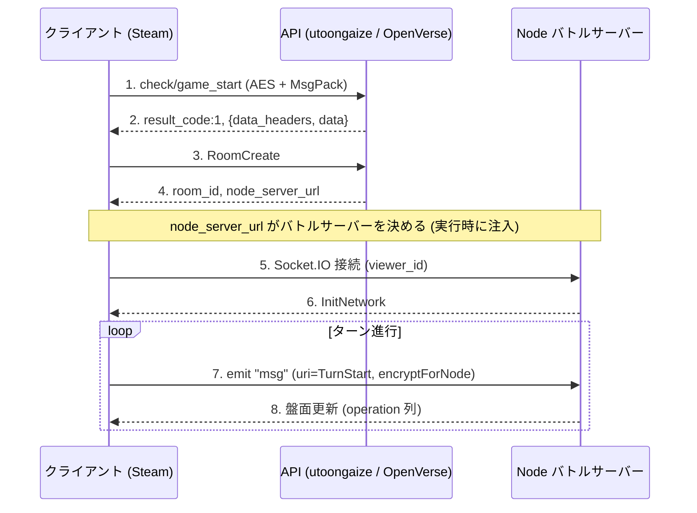

# OpenVerse プロトコル

## クライアント

- Steam版 Shadowverse (App ID 453480)
- Unity 2020.3.18 LTS，Monoビルド (Assembly-CSharp.dllをそのまま逆コンパイルできる)
- ルートの名前空間: `Wizard`
- API基盤の名前空間: `Cute` (Cygames内製)
- 通信: BestHTTP (Socket.IOクライアント同梱)，MessagePack (neuecc版)，LitJson / MiniJSON，Sqlite3
- メモリ改ざん対策としてCodeStage AntiCheat (ObscuredTypes) を使用

## サーバー (本番ドメイン)

`Cute.CustomPreference.InitFrameWorkSettings`にハードコードされていた値です．

| 用途 | URL | スキーム |
| --- | --- | --- |
| API (PHP) | `utoongaize.shadowverse.jp/shadowverse/` | https |
| リソースCDN | `shadowverse.akamaized.net/` | https |
| Node (バトル) | 最初は空で，マッチ応答の`node_server_url`で実行時に設定 | ws:// (wss:// も可) |
| DeckBuilder | `shadowverse-portal.com/api/v1/game_api/` | https |

- APIとCDNは`SetScemeMode(Https)`でHTTPS固定
- NodeのURLは起動時は空．マッチ応答の`data.node_server_url`が`SetNodeServerURL`に渡す
- OpenVerseがマッチ応答で自前のNodeアドレスを返せば，クライアントは自動でそこに繋ぐ (バイナリパッチ不要)

## 暗号 (`CryptAES`)

鍵はメッセージごとにランダム生成し，暗号文に同梱します．IVは端末のUDID由来です．

### API用`encrypt` / `EncryptRJ256Api`
- AES-256-CBC，ブロック128
- key = `Cryptographer.generateKeyString()` (ランダム32 byte)
- IV = `Certification.Udid`のハイフンを除いた先頭16 byte
- 構造: `[暗号文][key(32 byte平文)]` (末尾に鍵)
- 復号は末尾32 byteを鍵として取り出す

### Node用`encryptForNode` / `DecryptRJ256ForNode`
- AES-256-CBC / PKCS7，ブロック128
- key = ランダム32 byte，IV = keyの先頭16 byte
- 構造: `[key(32 byte平文)][base64(暗号文)]` (先頭に鍵)

## ペイロード

### API (HTTP)
- ボディは`_createBodyMsgpack` (既定) か`_createBodyJson`
- `encrypt=true`のとき`CryptAES.encrypt` (= EncryptRJ256Api) を通す
- リクエストは`PostParams`をJSON→MessagePack→AESで暗号化して生バイトで送る
- レスポンス: `{ data_headers: { result_code, servertime }, data: {...} }`
- レスポンスは`CryptAES.decrypt`後に`MessagePackSerializer.ToJson`で読む．ボディはbase64テキスト
- 成功は`result_code == 1`

### Node (Socket.IO)
- イベント名`msg` (通常) / `hand` (手札)
- 送信: `JSON -> encryptForNode -> MessagePackSerializer.Serialize(string)`
- 受信: `Deserialize<string> -> decryptForNode -> MiniJSON`
- メッセージは`uri`フィールドでコマンド種別を表す (InitNetwork / TurnStart / Resume / Watch / Maintenance ...)
- `Gungnir`という死活監視 (heartbeat) がある
- 非標準の混在: URLは`EIO=4`だが，ペイロードのフレーミングはEngine.IO v3 (`[type][ascii長さ][0xFF]`)，バイナリ添付はSocket.IO v2 (`{_placeholder,num}`と先頭`0x04`の別チャンク)．既定のトランスポートはpollingで，websocketに昇格する．PingInterval / PingTimeoutはクライアント側で2000 / 5000msに固定

## 認証

- `PostParams`: `viewer_id`，`steam_id`，`steam_session_ticket`
- Steamのセッションチケット認証
- 私設サーバーは検証を飛ばし，`viewer_id`の発行だけでスタブ化可

## リクエストヘッダ (`NetworkTask.PrepareHeaders`)

Udid，ShortUdid，SessionId，Param，Device，AppVersion，ResVersion，DeviceId，DeviceName，GraphicsDeviceName，IpAddress，PlatformOsVersion，KeyChain，IDFA，Locale，Language，CountryCode，Platform，IsWSS，IsIpv6，DevAccessSecretKey，CardMasterHash

## 起動フロー

1. `SetUp.InitFrameWorkSettings`: URLとスキームを設定し，`NetworkManager.Certification()`を呼ぶ
2. `CheckSpecialTitleTask`: 初回リクエスト (encrypt=true, useJson=false)．`Wizard.BaseTask`派生．`data_headers.result_code`と`servertime`だけ必要
3. `GameStartCheckTask` (`check/game_start`): 起動チェック．`Cute.NetworkTask`派生．`data.tos_state`，`policy_state`，`kor_authority_state`，`tos_id`，`policy_id`，`kor_authority_id`が必要
4. 以降ホーム遷移

## APIエンドポイント (`CuteNetworkDefine.ApiUrlList`，一部)

`tool/signup`，`check/special_title`，`check/game_start`，`account/get_by_social_account`，`account/chain_by_transition_code`，`payment/*`，`payment_pc/*` (Steam課金)

本編ゲームAPIは`Wizard.BaseTask`派生．パスはtypeから決まります (要調査)．

## 結果コード (一部)

- `1` = 成功
- `204` = バージョンエラー，`308` = 課金検証エラー
- `2000〜2999` = メンテナンス
- Node側: `30001/30213` = タイトル復帰，`30002` = 無効試合

## 通信シーケンス (例)

部屋を立ててバトルする流れです．図: [diagrams/battle-sequence.svg](diagrams/battle-sequence.svg)

ペイロードの包み方:

- API: `object -> JSON -> AES (末尾に鍵) -> HTTP body`
- Node: `object -> JSON -> AES (先頭に鍵) -> MsgPack(string) -> socket.emit`

## 未解明

- 本編APIのパス命名 (`Wizard.BaseTask`のtypeからパスへ)
- `DevAccessSecretKey` / `CardMasterHash`の生成方法．サーバーが検証するか
- ルームマッチのシーケンス (`Wizard.RoomMatch`のRoomOwner / RoomVisitor / RoomConnectController)
- バトルのoperationプロトコル (サーバー権威か，カード効果ロジックの所在)
