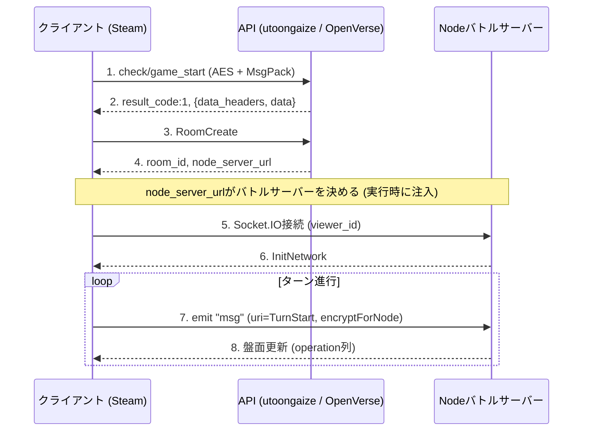

###  [English Here](en/protocol.md)

# OpenVerseプロトコル

## クライアント

- Steam版Shadowverse (App ID 453480)
- Unity 2020.3.18 LTS，Monoビルド (Assembly-CSharp.dllをそのまま逆コンパイルできる)
- ルートの名前空間: `Wizard`
- API基盤の名前空間: `Cute` (Cygames内製)
- 通信: BestHTTP (Socket.IOクライアント同梱)，MessagePack (neuecc版)，LitJson / MiniJSON，Sqlite3
- メモリ改ざん対策としてCodeStage AntiCheat (ObscuredTypes) を使用

## サーバー (本番ドメイン)

`Cute.CustomPreference.InitFrameWorkSettings`の値．

| 用途 | URL | スキーム |
| --- | --- | --- |
| API (PHP) | `utoongaize.shadowverse.jp/shadowverse/` | https |
| リソースCDN | `shadowverse.akamaized.net/` | https |
| Node (バトル) | 最初は空で，マッチ応答の`node_server_url`で実行時に設定 | ws:// (wss://も可) |
| DeckBuilder | `shadowverse-portal.com/api/v1/game_api/` | https |

- APIとCDNは`SetScemeMode(Https)`でHTTPS固定
- NodeのURLは起動時は空で，マッチ応答の`data.node_server_url`が`SetNodeServerURL`に渡る
- マッチ応答で自前Nodeアドレスを返せばクライアントはそこに繋ぐ (バイナリパッチ不要)

## 暗号 (`CryptAES`)

### API用`encrypt` / `EncryptRJ256Api`
- AES-256-CBC，ブロック128
- key = `Cryptographer.generateKeyString()` (ランダム32 byte)
- IV = `Certification.Udid`のハイフンを除いた先頭16 byte
- 構造: `[暗号文][key(32 byte平文)]` (末尾に鍵)
- 復号は末尾32 byteを鍵として取り出す

### Node用`encryptForNode` / `DecryptRJ256ForNode`
- AES-256-CBC / PKCS7，ブロック128
- key = ランダム32 byte，IV = keyの先頭16 byte
- 構造: `[key(32 byte平文)][base64(暗号文)]` (先頭に鍵)

## ペイロード

### API (HTTP)
- ボディは`_createBodyMsgpack` (既定) か`_createBodyJson`
- `encrypt=true`のとき`CryptAES.encrypt` (= EncryptRJ256Api) を通す
- リクエストは`PostParams`をJSON→MessagePack→AESで暗号化して生バイトで送る
- レスポンス: `{ data_headers: { result_code, servertime }, data: {...} }`
- レスポンスは`CryptAES.decrypt`後に`MessagePackSerializer.ToJson`で読み，ボディはbase64テキスト
- 成功は`result_code == 1`

### Node (Socket.IO)
- イベント名`msg` (通常) / `hand` (手札)
- 送信: `JSON -> encryptForNode -> MessagePackSerializer.Serialize(string)`
- 受信: `Deserialize<string> -> decryptForNode -> MiniJSON`
- メッセージは`uri`フィールドでコマンド種別を表す (InitNetwork / TurnStart / Resume / Watch / Maintenance ...)
- `Gungnir`という死活監視 (heartbeat) がある
- 非標準の混在: URLは`EIO=4`だが，ペイロードのフレーミングはEngine.IO v3 (`[type][ascii長さ][0xFF]`)，バイナリ添付はSocket.IO v2 (`{_placeholder,num}`と先頭`0x04`の別チャンク)．既定のトランスポートはpollingで，websocketに昇格する．PingInterval / PingTimeoutはクライアント側で2000 / 5000msに固定

## 認証

- `PostParams`: `viewer_id`，`steam_id`，`steam_session_ticket`
- Steamのセッションチケット認証
- 私設サーバーは検証を飛ばし，`viewer_id`の発行だけでスタブ化可

## リクエストヘッダ (`NetworkTask.PrepareHeaders`)

Udid，ShortUdid，SessionId，Param，Device，AppVersion，ResVersion，DeviceId，DeviceName，GraphicsDeviceName，IpAddress，PlatformOsVersion，KeyChain，IDFA，Locale，Language，CountryCode，Platform，IsWSS，IsIpv6，DevAccessSecretKey，CardMasterHash

## 起動フロー

1. `SetUp.InitFrameWorkSettings`: URLとスキームを設定し，`NetworkManager.Certification()`を呼ぶ
2. `CheckSpecialTitleTask`: 初回リクエスト (encrypt=true, useJson=false)．`Wizard.BaseTask`派生で，`data_headers.result_code`と`servertime`だけ必要
3. `GameStartCheckTask` (`check/game_start`): 起動チェック．`Cute.NetworkTask`派生で，`data.tos_state`，`policy_state`，`kor_authority_state`，`tos_id`，`policy_id`，`kor_authority_id`が必要
4. 以降ホーム遷移

## APIエンドポイント (`CuteNetworkDefine.ApiUrlList`，一部)

起動・認証・課金系: `tool/signup`，`check/special_title`，`check/game_start`，`account/get_by_social_account`，`account/chain_by_transition_code`，`payment/*`，`payment_pc/*`

本編ゲームAPIは`Wizard.BaseTask`派生で，種別ごとに以下のとおり．

## デッキAPI

Format wire code (以下`deck_format`) は`1=Rotation, 2=Unlimited, 3=PreRotation, 4=Crossover, 5=MyRotation, 10=TwoPick, 20=Sealed, 31=Hof, 33=Windfall, 39=Avatar, 0=All`で，内部enumとは別体系 (`FormatConvertApi`で変換)．

| Path | Request | Response主要フィールド |
| --- | --- | --- |
| `deck/info` | `deck_format` | Format.All時: `data.user_deck_rotation` / `_unlimited` / `_pre_rotation` / `_crossover` / `_my_rotation` / `_avatar` (全部guarded)．単一format時: `data.user_deck_list`で，`data.maintenance_card_list`は常にunguarded必須 |
| `deck/update` | `deck_no, class_id, leader_skin_id, is_random_leader_skin, leader_skin_id_list, sleeve_id, deck_name, is_delete(0/1), card_id_array, deck_format, rotation_id` (Crossoverは`sub_class_id`追加) | 更新後のuser_deck_*group + `data.achieved_info:{}` + `data.reward_list:[]` (両方unguarded) |
| `deck/get_empty_deck_number` | `deck_format` | `data.empty_deck_num:int` (0以下は空きなし) |
| `deck/update_name` | `deck_no, deck_name, deck_format` | `data.user_deck` (1件) |
| `deck/update_sleeve` | `deck_no, sleeve_id, deck_format` | `data.user_deck` |
| `deck/update_leader_skin` | `deck_no, leader_skin_id, deck_format` | `data.user_deck` |
| `deck/update_order` | `deck_order:int[], deck_format` | 更新後のgroup |
| `deck/delete_deck_list` | `deck_no_list:int[], deck_format` | 更新後のgroup |
| `auto_deck/create` | `deck_format, class_id, chosen_card_ids, tournament_id, rotation_id` | `data:[int...]` (フラットなカードID配列) |

unguarded必須キーは`deck_name` (string)，`class_id` (int 1-8)，`card_id_array` (int[]) で，他はguardedになっています．  
構築ルールはクライアント側で完結し，サーバーは`restricted_card_exists`と`maintenance_card_list`を返すのみで，OpenVerseは全カード開放であるため所持判定を使いません．  
デッキ共有 (portalの`deck_code` / `deck`) は別ホストで，OpenVerseではセルフホストしています．

## ソリティアコンテンツAPI

CP対戦 (練習戦) と大会上位デッキ紹介．バトルとAIはクライアント側で完結するので，サーバーはセットアップと結果記録だけを持ちます．

| Path | Request | Response主要フィールド |
| --- | --- | --- |
| `practice/info` | (なし) | `data:[{practice_id, text_id, class_id, chara_id, degree_id, ai_deck_level, ai_logic_level, ai_max_life, is_campaign_practice, battle3dfield_id, is_maintenance}...]` (配列直，PracticeDataMgrが反復) |
| `practice/deck_list` | `deck_format` (Format.All) | deck/infoと同じ形式 (ParseDeckInfoResponceDataで解析) |
| `practice/start` | `practice_id`等 | `data:{}` (mission_parameterがあれば読むだけ) |
| `practice/finish` | `deck_no, is_win, evolve_count, total_turn, enemy_class_id, difficulty, deck_format, class_id, mission, recovery_data` | `data:{get_class_experience, class_experience, class_level, achieved_info, reward_list}` (achieved_infoは空`{}`で可) |
| `introduce_deck/info` | `series_id` (-1=最新) | `data:{series_id, display_format, display_deck_list:[deck+player_name+introduction+thumbnail_card_id], series_list:[{series_id, series_name, is_ts_rotation}]}` |
| `introduce_deck/series_list` | (なし) | `data:{series_list:[...]}` |

- AIデッキとロジックはクライアントがマスタバンドル (`master_practice_ai_setting`) から`ai_deck_level`/`ai_logic_level`で引き，公式のものを使っています
- バトル開始にはload/indexの`open_battle_field_id_list` (解放済み背景IDの配列) が必須で，無いと`BattleManagerBase.CalculationRandomStage`でNREになります

## ルームマッチAPI (HTTP側)

| Path | 用途 | 主要Response |
| --- | --- | --- |
| `open_room/create_room` | オーナー作成 | `data.room_id` (5桁数字文字列), `data.node_server_url` (スキーム抜き), `data.battle_id`, `data.is_invitation_user:bool` (全部unguarded) |
| `open_room/enter_room` | ビジター入室 | `data.result_reason:int` (0=成功), `data.oppo_info.{oppoId,battlePoint,degreeId,emblemId,country_code,rank,max_rank,userName,isOfficial}`, `data.node_server_url`, `data.is_friend:int`, `data.guild_id/oppo_guild_id` (全unguarded) |
| `open_room/leave_room` | ビジター退室 | `data.result_reason`, `data.room_result:int(1=OK)` |
| `open_room/close_room` | オーナー解散 | `base.Parse`のみ (result_code=1で十分) |
| `open_room/force_release_room` | オーナー強制解散 | `data.room_result:int(1=OK)`で，クライアント側は10秒backoffでリトライ |
| `open_room/initialize_room_battle` | Socket接続後・戦闘開始前のbookkeeping | `data.battle_id`, `data.my_battle_result:{}`, `data.opponent_battle_result:{}`, `data.used_deck:int`, `data.is_settled:int` |
| `open_room_battle/set_deck` | 部屋内デッキ選択 | 未parse (result_code=1で十分)で，variantとして`gathering_room_battle/set_deck`等あり |
| `deck/deck_entry` | 複数デッキ選択 (Bo3等) | 未parse |
| `open_room/ban_deck` | デッキbanフェーズ | 未parse |

補足:
- `room_id`はサーバー採番の5桁数字文字列
- `node_server_url`はスキーム抜きのhost:port (`127.0.0.1:3001`など) で，クライアントが`ws://`を先頭につける
- 参加通知はHTTPポーリングではなくSocketの`RoomEntry`プッシュで飛んでくる
- Socket ACK待ちタイムアウトは10秒

## do_matching (対戦相手の待機)

| Path | 用途 |
| --- | --- |
| `battle/do_matching` | ランクマッチ |
| `open_room_battle/do_matching` | ルームマッチ |

Responseは`data.matching_state:int` (3004=SUCCEEDED, 3007=SUCCEEDED_OWNER, 3011=SUCCEEDED_AI)，`data.timeout_period:int`，`data.retry_period:int`，`data.battle_id:string`，`data.node_server_url:string`，`data.card_master_id:int` (成功時) で，クライアントは通信に成功するまでポーリングします．

## バトル (Socket.IO)

接続先: `ws://<node_server_url>/?EIO=4&transport=websocket`

### WS upgradeヘッダ

URLクエリではなくHTTPヘッダに載ります．

- `BattleId`: 生文字列
- `viewerId`: `CryptAES.encryptForNode(viewerId.ToString())`で，先頭32文字が鍵，残りがbase64暗号文
- `User-Agent`: `SystemInfo.operatingSystem`

### イベント名

- `msg`: 通常のイベントで，payload = `MessagePack(CryptAES.encryptForNode(JSON(...)))`，サーバーはintの`pubSeq`でACKが必須
- `hand`: 手札操作 (touch / slide / select_skill)．payload = `MessagePack(JSON(...))` (AESなし)
- `synchronize`: サーバーから送るpush専用で，全uriがここに乗るので`event`名を`uri`名にしない
- `alive`: heartbeat (Gungnir) で，InitNetwork成功後に開始される

### payload共通フィールド

- `uri`: コマンド種別
- `viewerId:int`
- `uuid:string` (`Certification.Udid`)
- `bid:string` (マッチング後に付くbattle_id)
- `pubSeq:int` (client→server連番，1始まりmonotonic)
- `playSeq:int` (server→client連番，サーバー採番)
- `cat:int` (EmitCategory: `1=battle, 2=matching, 3=room, 11=watch, 99=general`)

### 接続後のシーケンス

1. Client→`InitNetwork` (cat:99) → Server→`InitNetwork` echo (payloadは任意で`_initNetworkSuccess`が立てば通る)
2. Client→`RoomCreate` (owner) or `RoomEntry` (visitor) (cat:3) → Server ACKに`resultCode:1` (`ReceiveNodeResultCode.Success`)
3. 両者がデッキ選択と`RoomReady`を終えるとServer→`Matched`: `{uri, bid, turnState:0|1, selfInfo, oppoInfo, selfDeck:[{idx,cardId}...], playSeq:1}`
4. Both→`Loaded` (cat:1, pubSeq:2) → Server→`BattleStart` (playSeq:2): `{uri, battleStartDate:<unix-microseconds>, selfInfo, oppoInfo}`
5. Server→`Deal` (playSeq:3): `{uri, cards:[{idx,cardId,isSelf,RedrawCardPosition}...]}` → Client→`Swap` → Server→`Ready`

### Matched必須subkey

欠けるとクライアントがクラッシュする．

- `selfInfo`: `rank, classId, charaId, viewerId, userName, fieldId, seed, deckCount`
- `oppoInfo`: `selfInfo`と同じ + 任意の`isOfficial`
- `selfDeck`: `idx, cardId`

### プレイヤー識別

WS upgradeの`BattleId`ヘッダ + `viewerId`ヘッダ (要復号)，各msg payloadの`viewerId`と`uuid`で照合し，対戦相手のviewerIdはサーバー側でペアリングして`Matched.oppoInfo.viewerId`に載せる．

### ROOM_URI

`Wizard.RoomMatch.RoomUri`の列挙値をそのまま乗せるが，現時点で使うのは`RoomCreate / RoomEntry / GatheringEntry / Leave / Release / ForceRelease / DeckSelect / DeckConfirm / TurnSelect / RoomReady / Rematch`などのみ．

## 結果コード (一部)

- `1` = 成功
- `204` = バージョンエラー，`308` = 課金検証エラー
- `2000〜2999` = メンテナンス
- Node側: `30001/30213` = タイトル復帰，`30002` = 無効試合

## 通信シーケンス (例)

ルームマッチの流れ (図: [diagrams/battle-sequence.svg](diagrams/battle-sequence.svg))．

ペイロードの包み方:

- API: `object -> JSON -> AES (末尾に鍵) -> HTTP body`
- Node: `object -> JSON -> AES (先頭に鍵) -> MsgPack(string) -> socket.emit`

## 未解明

- `DevAccessSecretKey` / `CardMasterHash`の生成方法とサーバー側での検証有無
- BattleStart以降の全バトルURI (TurnStart / PlayActions / TurnEndActions / TurnEnd / Judge / BattleFinish等) の詳細と，operation列の内訳
- カード効果の解決先 (サーバー側かクライアント側か)
- 復帰系 (`open_room/get_recovery_params`，`battle/get_recovery_params`) の仕様
